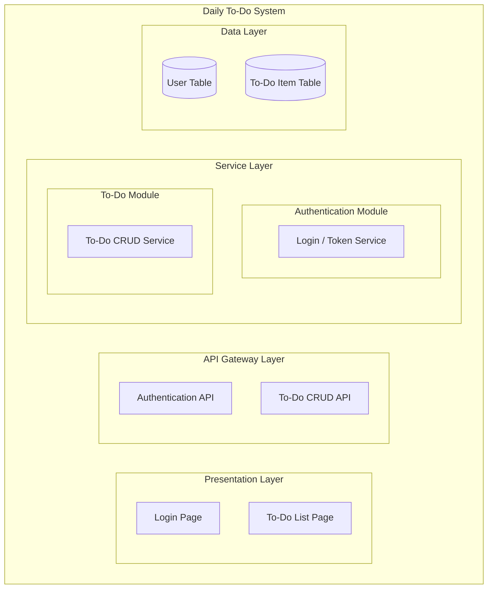
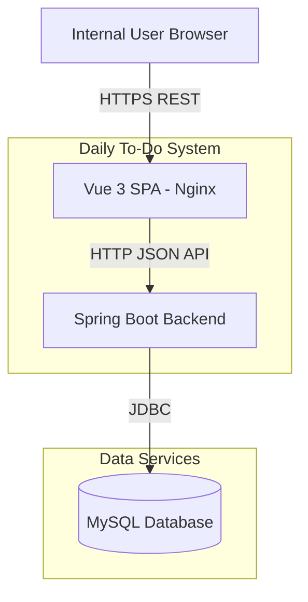
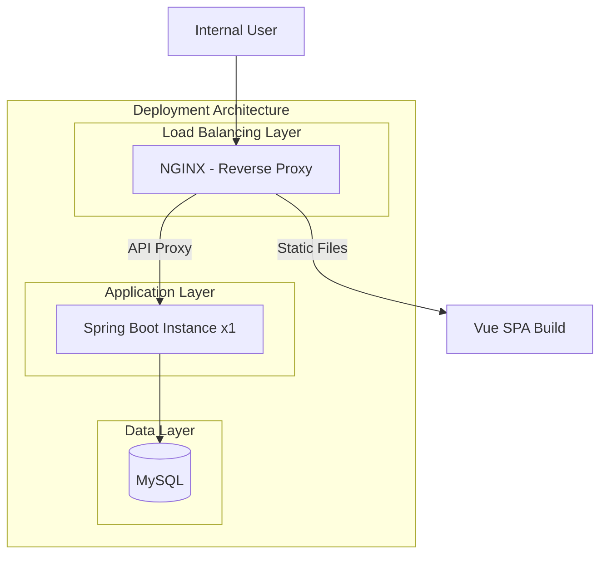
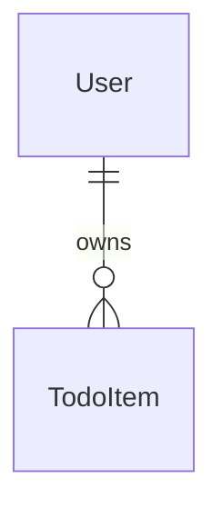
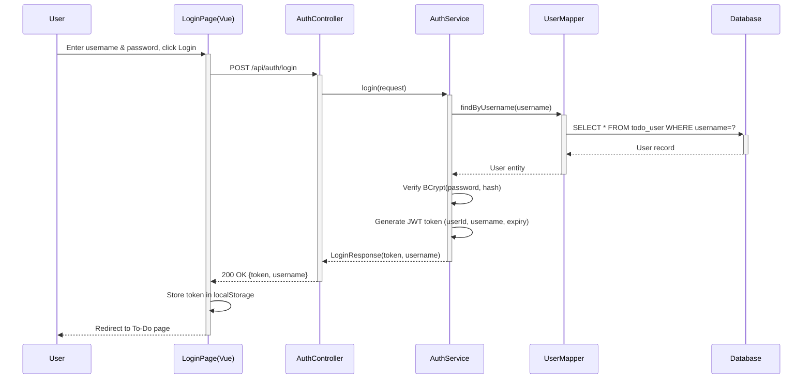
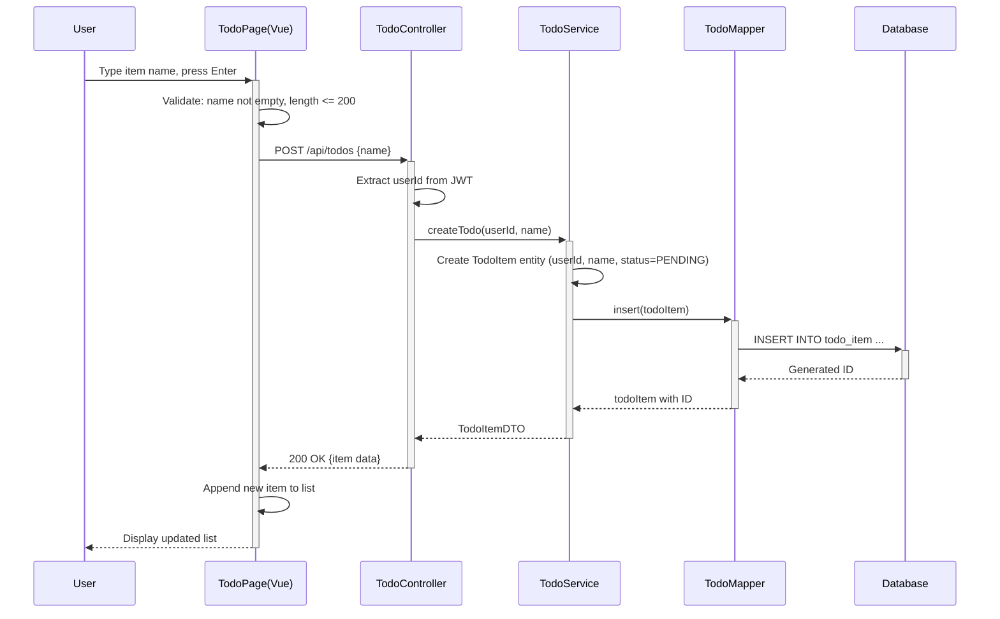
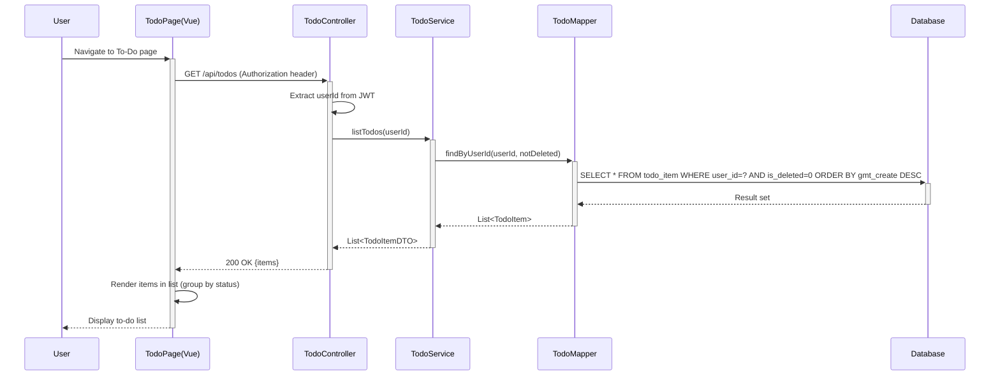
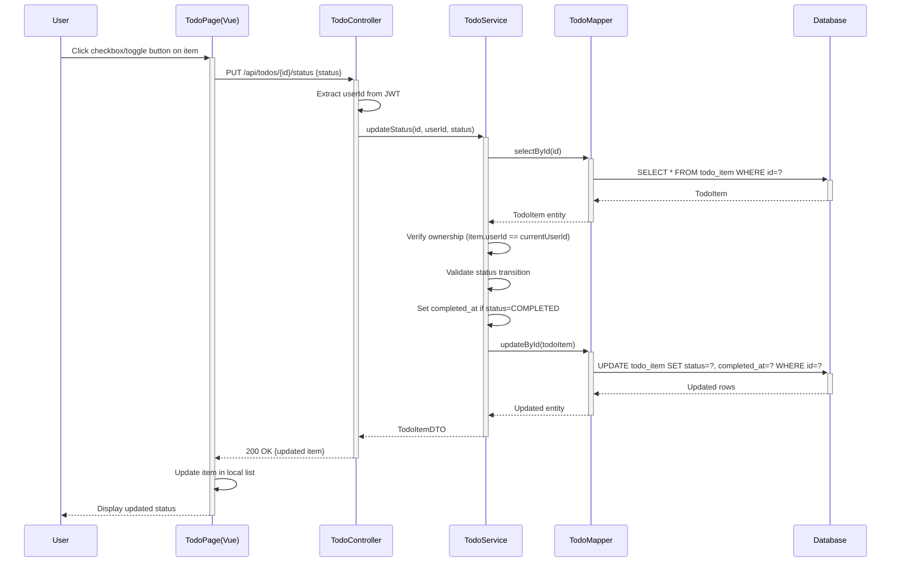
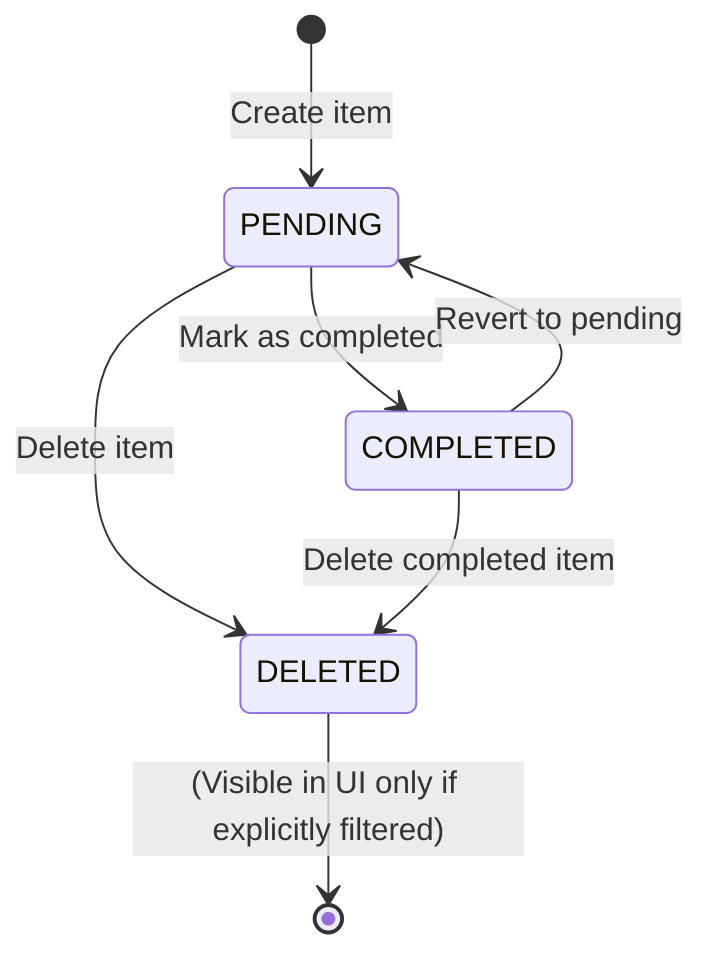
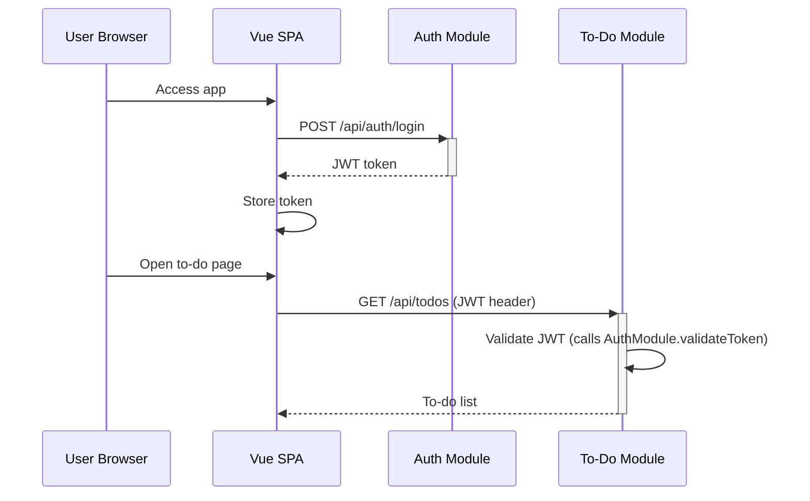

> **Document Metadata**
>
> | Item | Content |
> |------|------|
> | Document Version | v1.0 |
> | Author | AiWork System Analysis & Design |
> | Creation Date | 2026-09-15 |
> | Requirement Source | Internal requirement: Help users record daily to-do items |
> | Review Status | Pending Review |

# Daily To-Do System — System Analysis Design

## 1. Requirement and Scope

### Background and Objectives
Internal users need a lightweight daily to-do list tool to record and manage daily tasks. The goal is to provide a simple, fast, and intuitive interface for creating to-do items, reducing reliance on paper notes or scattered digital tools. The existing repository (`manyu-test1-frontend`) is a Vue 3 SPA demo project; the to-do feature will be added as a new module.

### Core Features
- **F01**: Create a new to-do item with name information
- **F02**: View to-do list (display all created items)
- **F03**: Mark to-do item as completed
- **F04**: Delete a to-do item
- **F05**: Basic authentication for internal users

### Constraints and Non-functional Requirements
- Internal users only; no public registration
- Simple and fast to use, minimal clicks to add a task
- Frontend: Vue 3 SPA (existing project); Backend: Spring Boot RESTful API (new); Database: MySQL
- Data persistence with soft-delete for safety

### Excluded Scope
- Complex task management (subtasks, tags, categories, due dates)
- Collaborative/shared to-do lists
- Mobile push notifications
- File attachments
- Calendar integration
- Reminder/alarm functionality

### Requirement Feature List and Priority

| ID | Feature Point | Priority | PRD Original Description/Section | Remarks |
|------|--------|--------|---------|------|
| F01 | Create to-do item | P0 | User inputs item name to create a new to-do item | Core feature |
| F02 | View to-do list | P0 | Display all to-do items with status | Core feature |
| F03 | Mark as completed | P1 | Toggle item status from pending to completed | Extends core workflow |
| F04 | Delete to-do item | P1 | Remove an item from the list | Essential for management |
| F05 | User login/authentication | P1 | Internal users authenticate via username/password | Security baseline |

### Assumptions and Items to Confirm

| ID | Assumption/Item to Confirm | Current Assumption | Confirmation Status |
|------|------|------|------|
| A01 | Internal authentication scheme | Simple JWT-based token auth with username/password login; no OAuth/SSO required | Pending |
| A02 | Deployment environment | Containerized deployment on internal server; single-instance sufficient for internal tool | Pending |
| A03 | Pagination not needed initially | Assume <1000 items per user; load all in one request | Pending |
| A04 | Item name length limit | 200 characters max | Pending |
| A05 | User data isolation | Each user sees only their own to-do items (filtered by user_id) | Pending |

## 2. Architecture and Modules

### Functional Architecture



- **Presentation Layer**: Vue 3 SPA components — login page, to-do list page
- **API Gateway Layer**: RESTful API endpoints for authentication and to-do operations
- **Service Layer**: Business logic split into Auth module and To-Do module
- **Data Layer**: MySQL tables for user accounts and to-do items

**Module List**

| Module | Responsibility | Dependencies |
|------|------|------|
| Authentication Module | User login, JWT token generation & validation | MySQL (user table) |
| To-Do Module | CRUD operations on to-do items, status management | MySQL (todo table), Authentication Module |

### Application Integration Architecture



**Integration Relationship Description:**

| Caller | Callee | Protocol | Interface Type | Description |
|--------|------|------|------|------|
| User Browser | Vue SPA (Nginx) | HTTPS | Static files + AJAX | Vue app served via Nginx; browser calls backend API |
| Vue SPA | Spring Boot Backend | HTTP | RESTful JSON API | Axios HTTP client to backend |
| Spring Boot Backend | MySQL | JDBC | SQL | Data persistence |

### Deployment Architecture



**Deployment Notes:**
- **Load Balancing Layer**: Nginx serves Vue SPA static files and reverse-proxies API requests to the Spring Boot backend
- **Application Layer**: Single Spring Boot instance (sufficient for internal tool scale); JAR deployment via Docker
- **Data Layer**: Single MySQL instance; regular backup strategy
- **Assumption**: Internal tool, low traffic; single-instance sufficient. Horizontal scaling when needed

## 3. Data Model and Storage

### Entity List

| Entity Name | Entity Description | Owning Module | Relationship with Other Entities |
|----------|----------|----------|-----------------|
| User | Internal system user accounts | Authentication Module | One-to-many with TodoItem (one user owns many to-do items) |
| TodoItem | A single to-do task record | To-Do Module | Many-to-one with User (each item belongs to one user) |

### Entity Relationship Diagram



**Model Notes:**
- One user can have zero or many to-do items
- Each to-do item belongs to exactly one user
- User data is isolated at the service layer via `user_id` filtering
- No cache or MQ required at this scale

## 4. Interface Design

### 4.1 oneapi (Web Console Interfaces)

| ID | Interface Name | Method | Path | Module |
|------|----------|------|------|------|
| W01 | User Login | POST | /api/auth/login | Authentication |
| W02 | Get To-Do List | GET | /api/todos | To-Do |
| W03 | Create To-Do Item | POST | /api/todos | To-Do |
| W04 | Update To-Do Status | PUT | /api/todos/{id}/status | To-Do |
| W05 | Delete To-Do Item | DELETE | /api/todos/{id} | To-Do |

### 4.2 OpenAPI (External Interfaces)
Not applicable — internal tool, no external API exposure.

### 4.3 Internal Interfaces (Service Layer)

| ID | Interface Name | Class | Method Signature |
|------|----------|------|----------|
| S01 | Login | AuthService | login(LoginRequest): LoginResponse |
| S02 | Validate Token | AuthService | validateToken(String): UserInfo |
| S03 | Get All Todos | TodoService | listTodos(Long userId): List<TodoItemDTO> |
| S04 | Create Todo | TodoService | createTodo(CreateTodoRequest): TodoItemDTO |
| S05 | Update Status | TodoService | updateStatus(Long id, String status): TodoItemDTO |
| S06 | Delete Todo | TodoService | deleteTodo(Long id): void |

### 4.4 Integration Interfaces (Integration Layer)
Not applicable — no external system integration required.

## 5. Feature Module Design

### 5.1 Authentication Module

#### 5.1.1 Table Structure Design

##### 5.1.1.1 todo_user

| Field Name | Data Type | Constraint | Default Value | Description |
|--------|----------|------|--------|------|
| id | bigint | PK, Auto-increment | - | System auto-increment primary key |
| username | varchar(64) | UNIQUE, NOT NULL | - | Login username |
| password_hash | varchar(256) | NOT NULL | - | BCrypt-encrypted password hash |
| is_deleted | tinyint(1) | NOT NULL | 0 | Soft delete flag: 0=normal, 1=deleted |
| gmt_create | datetime | NOT NULL | CURRENT_TIMESTAMP | Creation time |
| gmt_modified | datetime | NOT NULL | CURRENT_TIMESTAMP ON UPDATE | Modification time |

**Indexes:**
- UK: `uk_todo_user_username` (username)

##### 5.1.1.x Enum and Constant Definitions
This module has no enum/constant definitions.

#### 5.1.2 Interface Detailed Design

##### W01: User Login

- **URI**: POST /api/auth/login
- **Description**: Authenticate user and return JWT token
- **Input Parameters**:

| Parameter Name | Type | Required | Description |
|----------|------|----------|------|
| username | String | Yes | Login username |
| password | String | Yes | Login password (plaintext) |

- **Output Parameters**:

| Parameter Name | Type | Description |
|----------|------|------|
| code | String | Result code (OK / error) |
| msg | String | Prompt message |
| data | Object | Business data |
| data.token | String | JWT access token |
| data.username | String | Logged-in username |

- **Error Codes**:

| Error Code | Description |
|--------|------|
| AUTH_001 | Invalid username or password |
| AUTH_002 | Account disabled |

- **Business Rules**: Password verified against stored BCrypt hash; token expires in 24 hours

- **Request Example**:
```json
{
  "username": "admin",
  "password": "password123"
}
```

- **Response Example**:
```json
{
  "code": "OK",
  "msg": "SUCCESS",
  "data": {
    "token": "eyJhbGciOiJIUzI1NiIs...",
    "username": "admin"
  }
}
```

#### 5.1.3 Sub-feature Detailed Design

##### 5.1.3.1 User Login (F05)

- **Processing Sequence Diagram**


**Business Rules:**
| Rule ID | Rule Description | Validation Timing | Handling When Not Satisfied |
|----------|----------|----------|--------------|
| R01 | Username must exist in database | On login | Return AUTH_001 "Invalid username or password" |
| R02 | Password must match stored hash | On login | Return AUTH_001 "Invalid username or password" |

**Exception Scenarios:**
| Exception Scenario | Handling |
|----------|----------|
| Username not found | Return AUTH_001; do not reveal whether username or password is wrong |
| Password mismatch | Return AUTH_001; same generic message to prevent enumeration |
| Database connection failure | Return 500 with generic error message |

**Concurrency Control:**
- No concurrency risk — login is read-only on user data.

### 5.2 To-Do Module

#### 5.2.1 Table Structure Design

##### 5.2.1.1 todo_item

| Field Name | Data Type | Constraint | Default Value | Description |
|--------|----------|------|--------|------|
| id | bigint | PK, Auto-increment | - | System auto-increment primary key |
| user_id | bigint | NOT NULL, FK->todo_user.id | - | Owning user ID |
| name | varchar(200) | NOT NULL | - | To-do item name/content |
| status | varchar(16) | NOT NULL | 'PENDING' | Item status: PENDING / COMPLETED / DELETED |
| completed_at | datetime | NULL | NULL | Timestamp when marked as completed |
| is_deleted | tinyint(1) | NOT NULL | 0 | Soft delete flag |
| gmt_create | datetime | NOT NULL | CURRENT_TIMESTAMP | Creation time |
| gmt_modified | datetime | NOT NULL | CURRENT_TIMESTAMP ON UPDATE | Modification time |

**Indexes:**
- IDX: `idx_todo_item_user_id` (user_id)
- IDX: `idx_todo_item_status` (status)

##### 5.2.1.x Enum and Constant Definitions

| Enum Name | Value | Meaning | Associated Field |
|----------|------|------|----------|
| TODO_STATUS_PENDING | PENDING | Pending (not yet completed) | todo_item.status |
| TODO_STATUS_COMPLETED | COMPLETED | Completed | todo_item.status |
| TODO_STATUS_DELETED | DELETED | Soft-deleted | todo_item.status |

#### 5.2.2 Interface Detailed Design

##### W02: Get To-Do List

- **URI**: GET /api/todos
- **Description**: Retrieve all to-do items for the authenticated user
- **Input Parameters**:

| Parameter Name | Type | Required | Description |
|----------|------|----------|------|
| (Header) Authorization | String | Yes | Bearer JWT token |

- **Output Parameters**:

| Parameter Name | Type | Description |
|----------|------|------|
| code | String | Result code |
| msg | String | Prompt message |
| data | Array | List of to-do items |
| data[].id | Long | Item ID |
| data[].name | String | Item name |
| data[].status | String | Current status |
| data[].completedAt | String | Completion time (ISO 8601) |
| data[].createdAt | String | Creation time (ISO 8601) |

- **Error Codes**:

| Error Code | Description |
|--------|------|
| AUTH_003 | Invalid or expired token |

**Business Rules**: Only returns items belonging to the authenticated user; excludes soft-deleted items

- **Response Example**:
```json
{
  "code": "OK",
  "msg": "SUCCESS",
  "data": [
    {
      "id": 1,
      "name": "Review design document",
      "status": "PENDING",
      "completedAt": null,
      "createdAt": "2026-09-15T10:00:00"
    }
  ]
}
```

##### W03: Create To-Do Item

- **URI**: POST /api/todos
- **Description**: Create a new to-do item
- **Input Parameters**:

| Parameter Name | Type | Required | Description |
|----------|------|----------|------|
| (Header) Authorization | String | Yes | Bearer JWT token |
| name | String | Yes | Item name (1-200 characters) |

- **Output Parameters**:

| Parameter Name | Type | Description |
|----------|------|------|
| code | String | Result code |
| msg | String | Prompt message |
| data | Object | Created to-do item |

- **Error Codes**:

| Error Code | Description |
|--------|------|
| TODO_001 | Item name is required |
| TODO_002 | Item name exceeds maximum length (200) |
| AUTH_003 | Invalid or expired token |

- **Request Example**:
```json
{
  "name": "Prepare weekly report"
}
```

- **Response Example**:
```json
{
  "code": "OK",
  "msg": "SUCCESS",
  "data": {
    "id": 2,
    "name": "Prepare weekly report",
    "status": "PENDING",
    "completedAt": null,
    "createdAt": "2026-09-15T11:00:00"
  }
}
```

##### W04: Update To-Do Status

- **URI**: PUT /api/todos/{id}/status
- **Description**: Mark a to-do item as completed or revert to pending
- **Input Parameters**:

| Parameter Name | Type | Required | Description |
|----------|------|----------|------|
| (Header) Authorization | String | Yes | Bearer JWT token |
| (Path) id | Long | Yes | To-do item ID |
| status | String | Yes | Target status: COMPLETED or PENDING |

- **Output Parameters**:

| Parameter Name | Type | Description |
|----------|------|------|
| code | String | Result code |
| msg | String | Prompt message |
| data | Object | Updated to-do item |

- **Error Codes**:

| Error Code | Description |
|--------|------|
| TODO_003 | To-do item not found |
| TODO_004 | Invalid status transition |
| AUTH_003 | Invalid or expired token |

- **Request Example**:
```json
{
  "status": "COMPLETED"
}
```

- **Response Example**:
```json
{
  "code": "OK",
  "msg": "SUCCESS",
  "data": {
    "id": 1,
    "name": "Review design document",
    "status": "COMPLETED",
    "completedAt": "2026-09-15T11:30:00",
    "createdAt": "2026-09-15T10:00:00"
  }
}
```

##### W05: Delete To-Do Item

- **URI**: DELETE /api/todos/{id}
- **Description**: Soft-delete a to-do item
- **Input Parameters**:

| Parameter Name | Type | Required | Description |
|----------|------|----------|------|
| (Header) Authorization | String | Yes | Bearer JWT token |
| (Path) id | Long | Yes | To-do item ID |

- **Output Parameters**:

| Parameter Name | Type | Description |
|----------|------|------|
| code | String | Result code |
| msg | String | Prompt message |
| data | null | - |

- **Error Codes**:

| Error Code | Description |
|--------|------|
| TODO_003 | To-do item not found |
| AUTH_003 | Invalid or expired token |

- **Response Example**:
```json
{
  "code": "OK",
  "msg": "SUCCESS",
  "data": null
}
```

#### 5.2.3 Sub-feature Detailed Design

##### 5.2.3.1 Create To-Do Item (F01)

- **Processing Sequence Diagram**


**Business Rules:**
| Rule ID | Rule Description | Validation Timing | Handling When Not Satisfied |
|----------|----------|----------|--------------|
| R01 | Item name must not be empty | On create | Return TODO_001 |
| R02 | Item name length ≤ 200 characters | On create | Return TODO_002 |
| R03 | Item must be associated with authenticated user | On create | System auto-assigns from JWT token |

**Exception Scenarios:**
| Exception Scenario | Handling |
|----------|----------|
| Database insert failure | Return 500, rollback; client shows "Failed to create, please retry" |
| Token expired/intercepted | Return AUTH_003; redirect to login page |

**Concurrency Control:**
- No concurrency risk — each create operation is independent; no duplicate detection needed

##### 5.2.3.2 View To-Do List (F02)

- **Processing Sequence Diagram**


**Business Rules:**
| Rule ID | Rule Description | Validation Timing | Handling When Not Satisfied |
|----------|----------|----------|--------------|
| R04 | Only return items belonging to the authenticated user | On query | userId from JWT must match; otherwise empty list |
| R05 | Exclude soft-deleted items | On query | WHERE is_deleted=0 |

##### 5.2.3.3 Mark as Completed / Toggle Status (F03)

- **Processing Sequence Diagram**


**Business Rules:**
| Rule ID | Rule Description | Validation Timing | Handling When Not Satisfied |
|----------|----------|----------|--------------|
| R06 | User must own the to-do item | On update | Return TODO_003 "Item not found" (generic) |
| R07 | Only allow valid status transitions | On update | PENDING <-> COMPLETED only; DELETED items cannot be modified |

**Exception Scenarios:**
| Exception Scenario | Handling |
|----------|----------|
| Item not found (wrong id or wrong user) | Return TODO_003; generic message |
| Status transition to/from DELETED | Return TODO_004 "Invalid status transition" |
| Concurrent update on same item | Last-write-wins (acceptable for internal tool); no optimistic lock needed |

**State Machine Design:**



**State Transition Rules:**
| Current State | Target State | Transition Condition | Pre-validation | Trigger Action |
|----------|----------|----------|----------|----------|
| PENDING | COMPLETED | User clicks "Complete" | Ownership check | Set completed_at = now() |
| COMPLETED | PENDING | User clicks "Undo" | Ownership check | Set completed_at = null |
| PENDING | DELETED | User clicks "Delete" | Ownership check | Set is_deleted = 1 |
| COMPLETED | DELETED | User clicks "Delete" | Ownership check | Set is_deleted = 1 |

##### 5.2.3.4 Delete To-Do Item (F04)

- Flow similar to status update; soft-delete only (set is_deleted=1)
- User must own the item to delete it

### 5.3 Cross-Module Call Chain



## 6. Non-Functional Requirement Design

### 6.1 High Availability
Not applicable for this item — internal tool with single-instance deployment. If higher availability is required in the future, add a second Spring Boot instance behind Nginx. Database availability covered by MySQL daily backup.

### 6.2 Extensibility
- Frontend: component-based Vue 3 design; adding new features (categories, due dates) requires only new components + API endpoints
- Backend: Controller-Service-Mapper layering; new modules follow the same pattern
- Database: new entities added as new tables; no schema migration conflicts

### 6.3 Stability/Reliability
- Input validation on both frontend (Vue form validation) and backend (Spring Validation)
- Ownership check on all mutations
- Safe against boundary inputs: empty strings, long strings, special characters rejected or sanitized

### 6.4 Security Design

#### 6.4.1 Account System Solution
Internal users provisioned via database script. JWT token-based authentication with BCrypt password hashing. No self-registration.

#### 6.4.2 Authorization & Access Control

##### 6.4.2.1 Horizontal Permission Check
Implemented at service layer: every to-do operation filters by `user_id` extracted from JWT token. User A cannot see or modify User B's items.

##### 6.4.2.2 Vertical Permission Check
Not applicable for this item — all internal users have the same role.

##### 6.4.2.3 Login State Check
- `/api/todos/*` — require valid JWT token
- `/api/auth/login` — public endpoint
- Frontend: redirect to login if 401 received

#### 6.4.3 Data Protection Solution

##### 6.4.3.1 Sensitive Data Encryption
- Passwords: BCrypt hash (one-way, salted)
- JWT tokens: signed with HMAC-SHA256 secret key

##### 6.4.3.2 Sensitive Data Masking
- No PII stored beyond username
- Passwords never logged or returned in API responses

### 6.5 Monitoring/Statistics/Logging/Alerting
- Backend: Spring Boot Actuator for health checks and metrics
- Request logging: log all API calls with method, path, userId, status, duration
- Error logging: log stack traces for unexpected exceptions
- **Assumption**: Basic file logging sufficient; no ELK/Grafana initially

## 7. Change Management Triad

### 7.1 Monitorable
- All API endpoints log: method, path, userId, HTTP status, processing duration
- MySQL slow query log (threshold: 100ms)
- Frontend: API error tracking via Axios interceptor
- Health endpoint: `/actuator/health`

### 7.2 Gradual Rollout
Not applicable for this item — single-instance internal tool with small user base. Future: Nginx canary routing if needed.

### 7.3 Emergency Response
- **Feature toggle**: `todo.feature.enabled=true/false` in application.yml — disable to-do feature without redeploy
- **Rollback plan**:
  - Frontend: revert Nginx static directory to previous Vue build
  - Backend: revert Docker image tag
  - Database: schema changes (new tables only) allow both old and new code to coexist safely
- **Upstream/downstream**: standalone system, no external service dependencies — rollback is isolated and safe