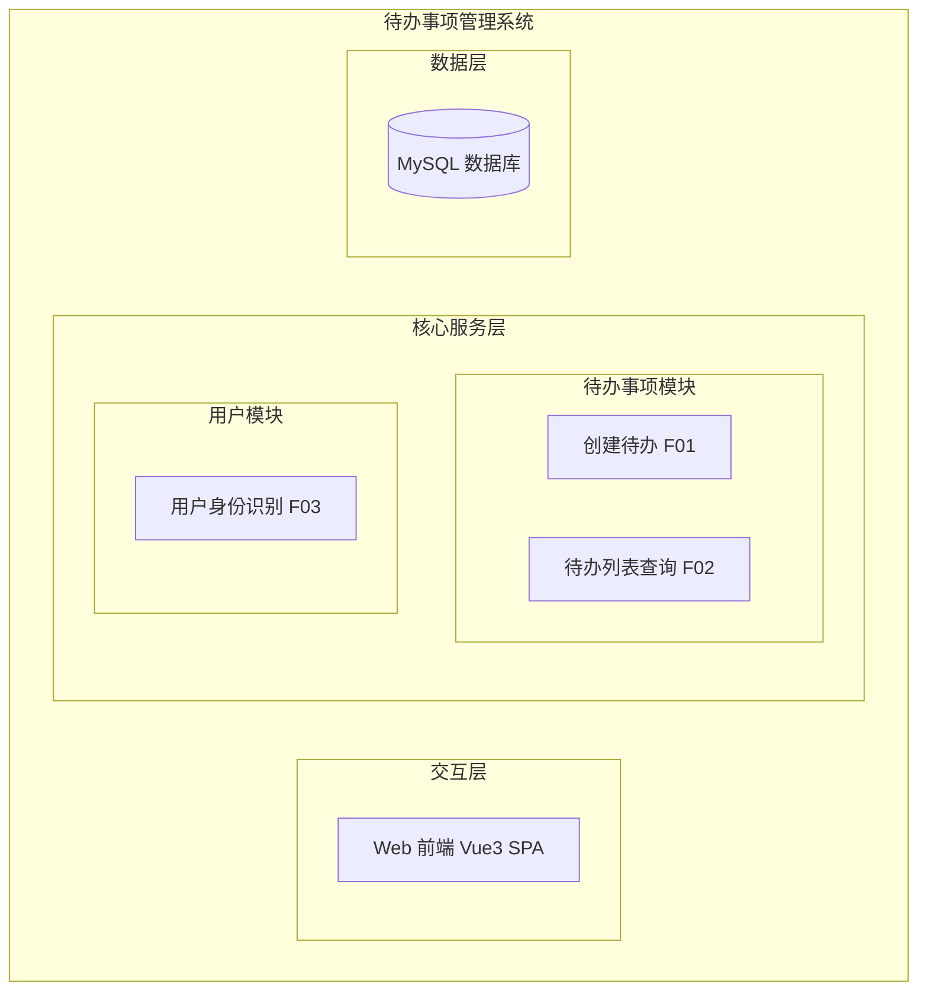
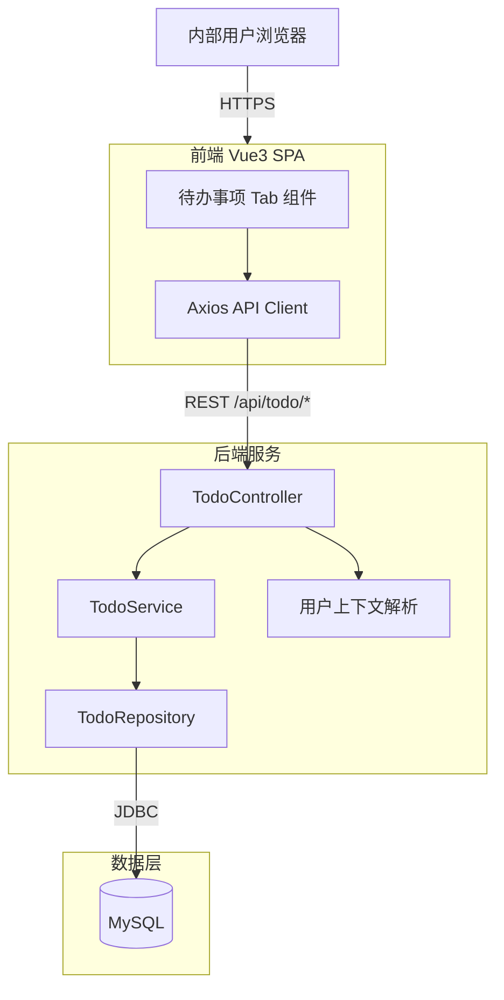
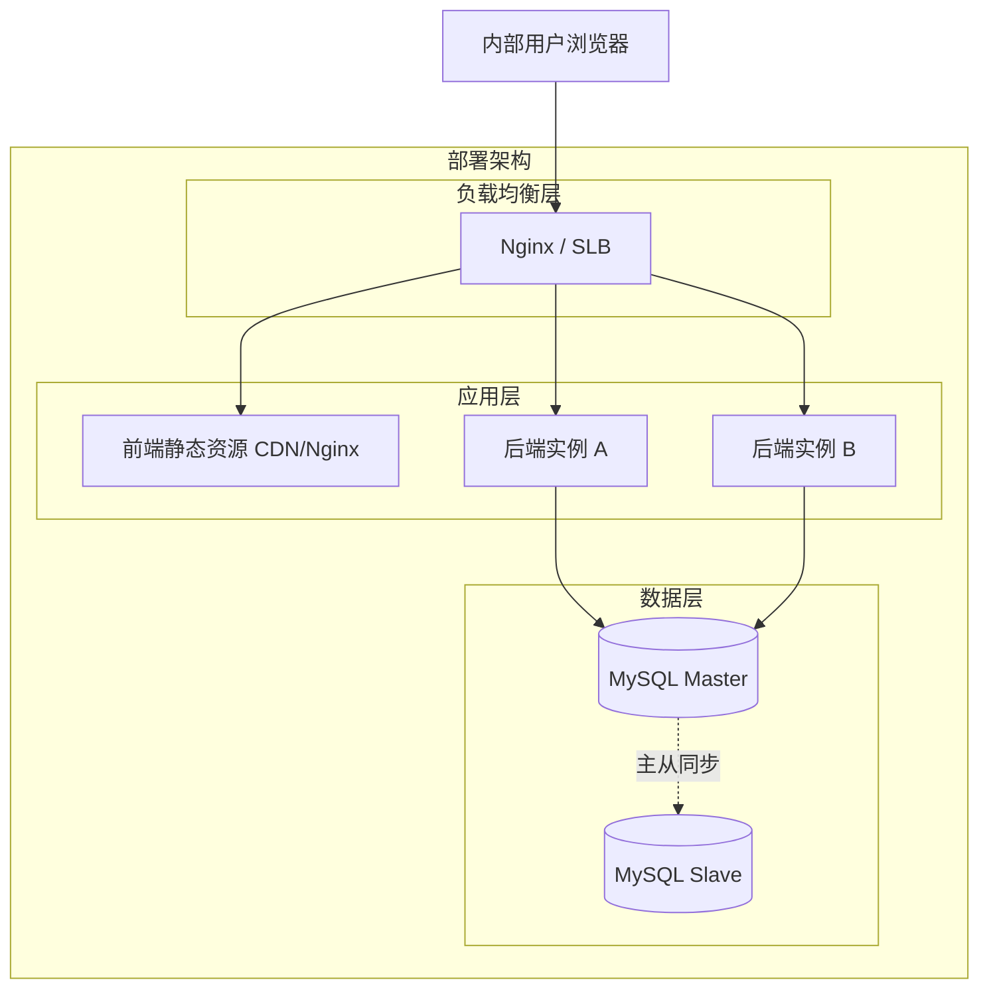
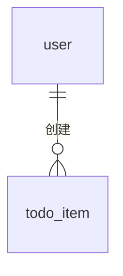
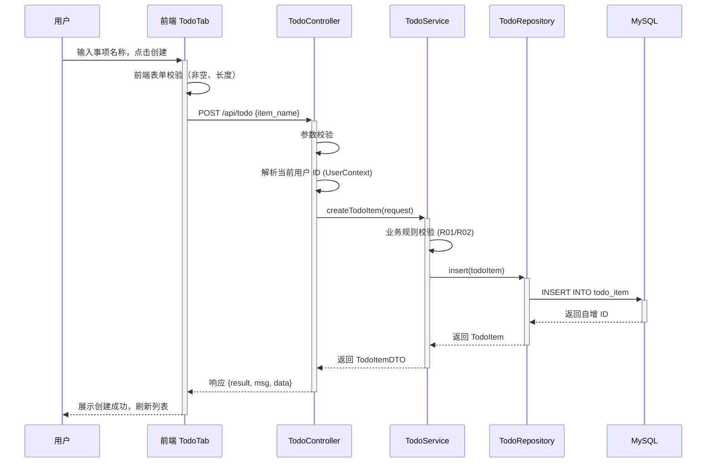
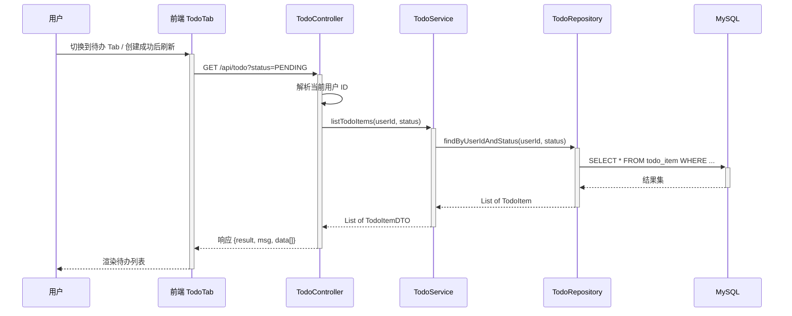
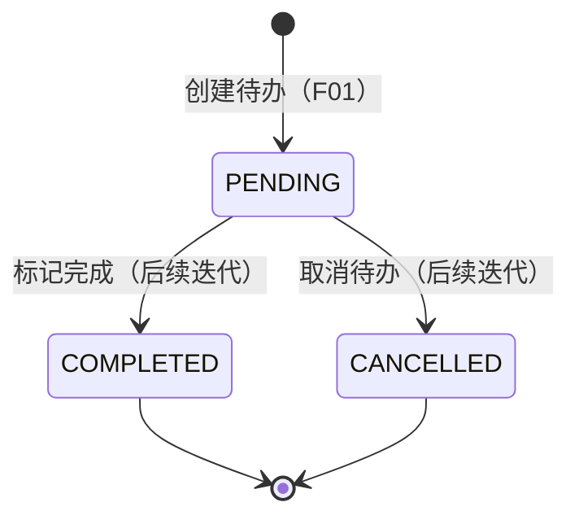

> **Document Metadata**
>
> | Item | Content |
> |------|------|
> | Document Version | v1.0 |
> | Author | System Analysis Auto-Process |
> | Creation Date | 2026-09-15 |
> | Requirement Source | User Requirement: "Help users record daily to-do items" |
> | Review Status | Pending Review |

# 每日待办事项管理 — 系统分析设计

## 1. 需求与范围

### 背景与目标

当前系统（manyu_test1）是一个基于 Vue 3 + Vite 的前端演示应用，已包含 Helloworld、哈希算法、冒泡排序三个功能 Tab 以及调用统计报表模块。本次需求目标是为内部用户新增"每日待办事项记录"能力，核心功能是创建新的待办项，帮助内部用户高效管理日常工作任务。

### 核心功能

1. 创建一个新的待办事项，必填信息为事项名称
2. 待办事项创建后进入"待办"状态，供用户后续跟踪

### 约束与非功能性需求

- **目标用户**：仅面向内部用户（通过现有内部账号体系识别身份）
- **前端技术栈**：Vue 3 + Vite + Axios，与现有 Tab 架构保持一致
- **接口规范**：遵循现有 `/api` 前缀 RESTful 风格
- **数据持久化**：需后端服务与数据库支持（本次设计覆盖全栈）

### 排除范围

| 排除项 | 说明 |
|--------|------|
| 待办事项编辑/删除 | 本次仅覆盖"创建"功能，编辑/删除作为后续迭代 |
| 待办事项完成/取消状态变更 | 本次仅创建，状态流转作为后续迭代 |
| 待办事项详情描述字段 | 需求仅提及"事项名称"，详情描述作为后续扩展 |
| 多人协作/任务分配 | 面向个人待办，不涉及协作 |
| 提醒/通知功能 | 不在本次范围内 |
| 外部用户访问 | 仅内部用户 |

### 需求功能列表与优先级

| ID | 功能点 | 优先级 | PRD 原始描述 | 备注 |
|------|--------|--------|-------------------|------|
| F01 | 创建待办事项 | P0 | "Core Feature: Create a new to-do item" | 核心功能，必填项为事项名称 |
| F02 | 待办事项列表展示 | P1 | "Help users record daily to-do items" | 创建后需要查看已创建的待办列表，隐含需求 |
| F03 | 内部用户身份识别 | P0 | "Target Users: Internal users" | 通过现有内部账号体系获取用户身份 |

### 假设与待确认项

| ID | 假设/待确认项 | 当前假设 | 确认状态 |
|------|-----------------|----------|----------|
| A01 | 用户身份获取方式 | 假设通过请求头或会话自动获取当前内部用户 ID，无需额外登录流程 | 待确认 |
| A02 | 事项名称长度限制 | 假设最大 200 字符，最小 1 字符 | 待确认 |
| A03 | 后端技术栈 | 假设后端采用 Node.js/Express 或 Java/Spring Boot，本次设计以通用 RESTful 接口为准，不绑定具体后端框架 | 待确认 |
| A04 | 数据库选型 | 假设使用 MySQL/关系型数据库（与现有项目规范一致） | 待确认 |
| A05 | 待办事项是否需要截止日期 | 需求仅提及"事项名称"，本次不包含截止日期字段，作为后续扩展 | 待确认 |
| A06 | 单个用户待办数量上限 | 假设不做硬性限制，但建议单用户活跃待办不超过 500 条 | 待确认 |

---

## 2. 架构与模块

### 功能架构



- **交互层**：Vue 3 SPA 前端，新增"待办事项"Tab 页，与现有 Tab 导航体系一致
- **核心服务层**：待办事项模块负责创建与查询业务逻辑；用户模块提供身份识别能力
- **数据层**：MySQL 持久化存储待办事项数据

**模块列表**

| 模块 | 职责 | 依赖 |
|------|------|------|
| 待办事项模块 (todo) | 待办事项的创建、列表查询 | 用户模块（获取当前用户身份） |
| 用户模块 (user) | 内部用户身份识别与会话管理 | 内部账号体系（已有） |
| 前端模块 (frontend) | 待办事项 Tab 页 UI 交互 | 待办事项模块 API |

### 应用集成架构



**集成关系描述：**

| 调用方 | 被调用方 | 协议 | 接口类型 | 说明 |
|--------|----------|------|----------|------|
| 用户浏览器 | 前端 SPA | HTTPS | 静态资源 | 页面加载 |
| 前端 SPA | 后端服务 | HTTPS | oneapi REST | `/api/todo/*` 接口调用 |
| 后端服务 | MySQL | TCP | JDBC/SQL | 数据读写 |

### 部署架构



**部署说明：**
- **负载均衡层**：Nginx 或云 SLB，前端静态资源与后端 API 分路径代理
- **应用层**：前端打包为静态资源由 Nginx/CDN 托管；后端至少 2 实例部署保障可用性
- **数据层**：MySQL 主从架构，读写分离可选

---

## 3. 数据模型与存储

### 实体列表

| 实体名称 | 实体说明 | 所属模块 | 与其他实体的关系 |
|----------|----------|----------|-----------------|
| todo_item | 待办事项记录，承载用户创建的每一条待办 | 待办事项模块 | 多对一关联 user（通过 user_id） |
| user | 内部用户（已有实体，非本次新增） | 用户模块 | 一对多关联 todo_item |

### 实体关系图



**模型说明：**
- `todo_item` 是本次新增的核心实体，每条记录代表一个待办事项
- 通过 `user_id` 关联创建者，实现数据隔离（每个用户只能看到自己的待办）
- `user` 实体为系统已有，本次不新增也不修改

---

## 4. 接口设计

### 4.1 oneapi（Web 控制台接口）

| ID | 接口名称 | Method | Path | 模块 |
|------|----------|------|------|------|
| W01 | 创建待办事项 | POST | /api/todo | 待办事项模块 |
| W02 | 查询待办列表 | GET | /api/todo | 待办事项模块 |

### 4.2 OpenAPI（外部接口）

本次不涉及，原因：目标用户仅为内部用户，不对外开放接口。

### 4.3 内部接口（Service 层）

| ID | 接口名称 | Class | Method Signature |
|------|----------|------|----------|
| S01 | 创建待办 | TodoService | createTodoItem(CreateTodoRequest): TodoItemDTO |
| S02 | 查询待办列表 | TodoService | listTodoItems(String userId): List&lt;TodoItemDTO&gt; |

### 4.4 集成接口（集成层）

本次不涉及，原因：无外部系统集成需求。

---

## 5. 功能模块设计

### 全局约定

| 约定项 | 约定值 |
|--------|--------|
| 错误码格式 | `TODO_{SEQ}`，如 `TODO_001` |
| 通用响应结构 | `{ result, msg, data }` |
| 时间格式 | ISO 8601 `yyyy-MM-dd HH:mm:ss` |

### 5.1 待办事项模块 (todo)

#### 5.1.1 表结构设计

##### 5.1.1.1 todo_item

| 字段名 | 数据类型 | 约束 | 默认值 | 说明 |
|--------|----------|------|--------|------|
| id | bigint | PK, Auto-increment | - | 系统自增主键 |
| item_name | varchar(200) | NOT NULL | - | 待办事项名称 |
| status | varchar(20) | NOT NULL | 'PENDING' | 待办状态：PENDING/COMPLETED/CANCELLED |
| user_id | varchar(64) | NOT NULL | - | 创建者用户 ID |
| gmt_create | datetime | NOT NULL | CURRENT_TIMESTAMP | 创建时间 |
| gmt_modified | datetime | NOT NULL | CURRENT_TIMESTAMP | 修改时间 |

**索引：**
- PK: `pk_todo_item` (id)
- IDX: `idx_todo_item_user_id` (user_id) — 按用户查询待办列表
- IDX: `idx_todo_item_user_status` (user_id, status) — 按用户+状态复合查询

##### 5.1.1.2 枚举与常量定义

| 枚举名 | 值 | 含义 | 关联字段 |
|----------|------|------|----------|
| TodoStatus | PENDING | 待办中 | todo_item.status |
| TodoStatus | COMPLETED | 已完成 | todo_item.status |
| TodoStatus | CANCELLED | 已取消 | todo_item.status |

#### 5.1.2 接口详细设计

##### W01 创建待办事项

- **URI**: POST /api/todo
- **说明**: 为当前登录的内部用户创建一条新的待办事项
- **输入参数**：

| 参数名 | 类型 | 必填 | 说明 |
|----------|------|----------|------|
| item_name | String | 是 | 待办事项名称，1~200 字符 |

- **输出参数**：

| 参数名 | 类型 | 说明 |
|----------|------|------|
| result | String | 结果码，OK 表示成功 |
| msg | String | 提示信息 |
| data | Object | 创建成功的待办事项对象 |
| data.id | Long | 待办事项 ID |
| data.item_name | String | 事项名称 |
| data.status | String | 状态（PENDING） |
| data.gmt_create | String | 创建时间 |

- **错误码**：

| 错误码 | 说明 |
|--------|------|
| TODO_001 | 事项名称不能为空 |
| TODO_002 | 事项名称超过 200 字符 |
| TODO_003 | 用户身份识别失败 |

- **业务规则**：创建时自动绑定当前登录用户 ID，初始状态为 PENDING

- **请求示例**：
```json
{
  "item_name": "完成季度报告"
}
```

- **响应示例**：
```json
{
  "result": "OK",
  "msg": "SUCCESS",
  "data": {
    "id": 1001,
    "item_name": "完成季度报告",
    "status": "PENDING",
    "gmt_create": "2026-09-15 10:30:00"
  }
}
```

##### W02 查询待办列表

- **URI**: GET /api/todo
- **说明**: 查询当前登录用户的所有待办事项（默认按创建时间倒序）
- **输入参数**：

| 参数名 | 类型 | 必填 | 说明 |
|----------|------|----------|------|
| status | String | 否 | 按状态筛选，可选值：PENDING / COMPLETED / CANCELLED，不传则查全部 |

- **输出参数**：

| 参数名 | 类型 | 说明 |
|----------|------|------|
| result | String | 结果码 |
| msg | String | 提示信息 |
| data | Array | 待办事项列表 |
| data[].id | Long | 待办事项 ID |
| data[].item_name | String | 事项名称 |
| data[].status | String | 状态 |
| data[].gmt_create | String | 创建时间 |

- **错误码**：

| 错误码 | 说明 |
|--------|------|
| TODO_003 | 用户身份识别失败 |
| TODO_004 | 无效的状态筛选值 |

- **请求示例**：
```
GET /api/todo?status=PENDING
```

- **响应示例**：
```json
{
  "result": "OK",
  "msg": "SUCCESS",
  "data": [
    {
      "id": 1001,
      "item_name": "完成季度报告",
      "status": "PENDING",
      "gmt_create": "2026-09-15 10:30:00"
    }
  ]
}
```

#### 5.1.3 子功能详细设计

##### 5.1.3.1 创建待办事项 (F01)

- 处理时序图



**业务规则：**

| 规则 ID | 规则描述 | 校验时机 | 不满足时处理 |
|----------|----------|----------|--------------|
| R01 | 事项名称不能为空（去除首尾空格后） | 创建时 | 返回错误码 TODO_001，提示"事项名称不能为空" |
| R02 | 事项名称长度不超过 200 字符 | 创建时 | 返回错误码 TODO_002，提示"事项名称不能超过 200 字符" |
| R03 | 当前用户身份必须有效 | 创建时 | 返回错误码 TODO_003，提示"用户身份识别失败，请重新登录" |

**异常场景：**

| 异常场景 | 处理方式 |
|----------|----------|
| 数据库写入失败 | 返回系统异常错误，提示"创建失败，请稍后重试"，记录错误日志 |
| 用户未登录或会话过期 | 返回 TODO_003，前端跳转登录或提示重新登录 |
| 并发重复提交 | 前端按钮防抖 + 后端幂等处理（同一用户同一事项名称不做唯一约束，允许重名） |

**并发控制：**
- 并发场景：同一用户快速连续点击创建按钮
- 控制策略：前端按钮点击后立即禁用（防抖），后端无唯一约束冲突，允许重名待办；数据库自增主键保证 ID 唯一性，无并发风险

##### 5.1.3.2 查询待办列表 (F02)

- 处理时序图



**业务规则：**

| 规则 ID | 规则描述 | 校验时机 | 不满足时处理 |
|----------|----------|----------|--------------|
| R04 | 仅查询当前用户自己的待办 | 查询时 | 强制 WHERE user_id = 当前用户 ID |
| R05 | 默认按创建时间倒序排列 | 查询时 | ORDER BY gmt_create DESC |
| R06 | status 参数仅接受合法枚举值 | 查询时 | 不传则查全部；非法值返回 TODO_004 |

**异常场景：**

| 异常场景 | 处理方式 |
|----------|----------|
| 数据库查询超时 | 返回系统异常，提示"加载失败，请稍后重试"，记录慢查询日志 |
| 用户无待办事项 | 返回空数组，前端展示"暂无待办"空状态 |

**并发控制：**
- 纯读操作，无并发写入冲突风险

**状态机设计：**



**状态转换规则：**

| 当前状态 | 目标状态 | 转换条件 | 前置校验 | 触发动作 |
|----------|----------|----------|----------|----------|
| — | PENDING | 创建待办 (F01) | 名称非空、用户有效 | 插入数据库记录 |
| PENDING | COMPLETED | 标记完成 | 后续迭代实现 | 后续迭代实现 |
| PENDING | CANCELLED | 取消待办 | 后续迭代实现 | 后续迭代实现 |

> 注：本次仅实现 `[*] → PENDING` 的创建转换，COMPLETED/CANCELLED 状态流转作为后续迭代。

---

## 6. 非功能性需求设计

### 6.1 高可用

- **后端服务**：至少部署 2 个实例，通过负载均衡分发请求；单实例故障时自动摘除，不影响服务可用性
- **数据库**：MySQL 主从架构，主库故障时可手动/自动切换至从库
- **降级策略**：当数据库不可用时，创建待办接口返回友好错误提示，不阻塞前端页面加载

### 6.2 可扩展性

- **水平扩展**：后端服务无状态设计，可通过增加实例数提升处理能力
- **功能扩展**：模块设计支持后续新增编辑、删除、截止日期、优先级等功能，表结构预留扩展空间
- **接口兼容**：采用 RESTful 设计，新增功能通过新接口或可选参数扩展，不破坏已有调用

### 6.3 稳定性/可靠性

- **数据一致性**：创建操作为单表写入，无分布式事务风险
- **幂等性**：创建接口允许重名但每次生成独立 ID，不存在幂等冲突
- **边界条件**：前端+后端双重校验事项名称长度与非空，防止异常数据入库

### 6.4 安全设计

#### 6.4.1 账号体系方案

复用现有内部账号体系（假设 A01），通过请求上下文自动获取当前用户身份，不引入额外登录流程。

#### 6.4.2 授权与鉴权

##### 6.4.2.1 是否做了水平权限校验

是。所有待办查询和创建操作强制绑定当前用户 ID（`user_id`），确保用户只能操作自己的待办数据。SQL 查询条件中 `WHERE user_id = ?` 为强制注入，不可由前端参数覆盖。

##### 6.4.2.2 是否做了垂直权限校验

本次不涉及垂直权限区分。所有内部用户具有相同的待办事项操作权限。

##### 6.4.2.3 是否校验了登录态

是。所有 `/api/todo/*` 接口均需校验登录态，未登录请求返回 TODO_003 错误。

#### 6.4.3 数据保护方案

##### 6.4.3.1 敏感数据是否加密存储

待办事项名称不属于敏感数据，无需加密存储。

##### 6.4.3.2 敏感数据是否脱敏展示

不涉及敏感数据，无需脱敏。

### 6.5 监控/统计/日志/告警

- **接口监控**：对 POST /api/todo 和 GET /api/todo 接口的 QPS、RT、错误率进行监控
- **错误日志**：数据库异常、参数校验失败等场景记录 WARN/ERROR 级别日志
- **告警**：接口错误率超过阈值（如 5%）时触发告警

---

## 7. 变更管理三件套

### 7.1 可监控

- 后端接口接入统一监控平台，采集以下指标：
  - 创建待办接口调用量、成功率、平均 RT
  - 查询待办列表接口调用量、成功率、平均 RT
  - 数据库慢查询监控（todo_item 表查询 RT > 200ms 告警）

### 7.2 灰度发布

- 前端：可通过 Feature Flag 控制"待办事项"Tab 的可见性，按用户 ID 尾号灰度开放
- 后端：新接口独立部署，不影响现有 HelloWorld / Hash / BubbleSort 接口；如需灰度可在网关层按用户 ID 分流

### 7.3 应急响应

- **开关控制**：前端 Feature Flag 可快速关闭待办事项 Tab 入口，回退至无此功能状态
- **回滚方案**：后端接口独立模块，回滚仅影响待办功能，不影响其他已有功能
- **数据兼容**：新增 `todo_item` 表为独立新表，回滚不涉及已有表变更，无数据迁移风险
- **上下游影响**：本功能不依赖外部系统，回滚不影响上下游

---

## 附录：方案评审检查清单

| 检查项 | 结果 | 说明 |
|--------|------|------|
| 模块划分合理性 | ✅ Pass | 待办模块单一职责，无循环依赖，功能点集中 |
| 依赖合理性 | ✅ Pass | 仅依赖用户模块（身份识别），依赖链简短清晰 |
| 单点故障（部署级） | ✅ Pass | 后端双实例 + MySQL 主从，无单点 |
| 表模型设计规范化 | ✅ Pass | 满足第三范式，字段无冗余，主键自增整数 |
| 隐私安全检查 | ✅ Pass | 待办事项名称非敏感数据，用户数据按 user_id 隔离 |
| 兼容性检查（接口） | ✅ Pass | 全新接口，无历史调用方，不存在兼容问题 |
| 兼容性检查（表） | ✅ Pass | 全新表，不影响已有表结构 |
| 数据迁移检查 | ✅ Pass | 新表无需数据迁移，建表后直接使用 |
| 一致性检查（功能点） | ✅ Pass | F01→5.1.3.1 创建待办, F02→5.1.3.2 查询列表, F03→UserContext 身份识别 |
| 一致性检查（表） | ✅ Pass | Step 3 的 todo_item 实体在 Step 5 有完整表结构定义 |
| 一致性检查（接口） | ✅ Pass | Step 4 的 W01/W02 在 Step 5 有详细接口设计 |
| 一致性检查（枚举） | ✅ Pass | TodoStatus 枚举与 todo_item.status 字段一致 |
| 状态机完整性 | ✅ Pass | 状态机图完整，无孤儿状态；后续迭代状态已预留标注 |
| 并发风险检查 | ✅ Pass | 创建操作采用前端防抖+自增主键，无并发冲突；查询为纯读 |
| 单点故障（定时任务级） | ⬜ N/A | 本次无定时任务 |
| 非功能设计可行性 | ✅ Pass | 高可用/安全/扩展设计均为通用成熟方案 |
| 变更管理-可监控 | ✅ Pass | 标准接口监控，实施可行 |
| 变更管理-灰度发布 | ✅ Pass | Feature Flag 方案成熟，前端按用户 ID 灰度 |
| 变更管理-应急响应 | ✅ Pass | 独立模块回滚不影响已有功能，新表无迁移风险 |
