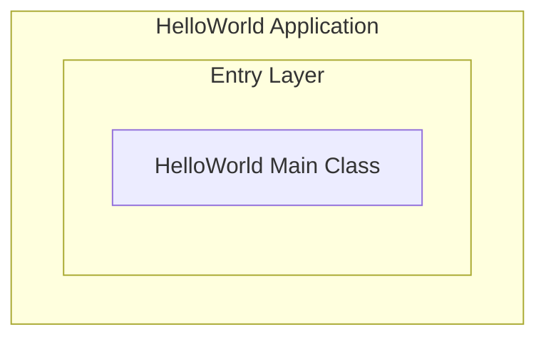
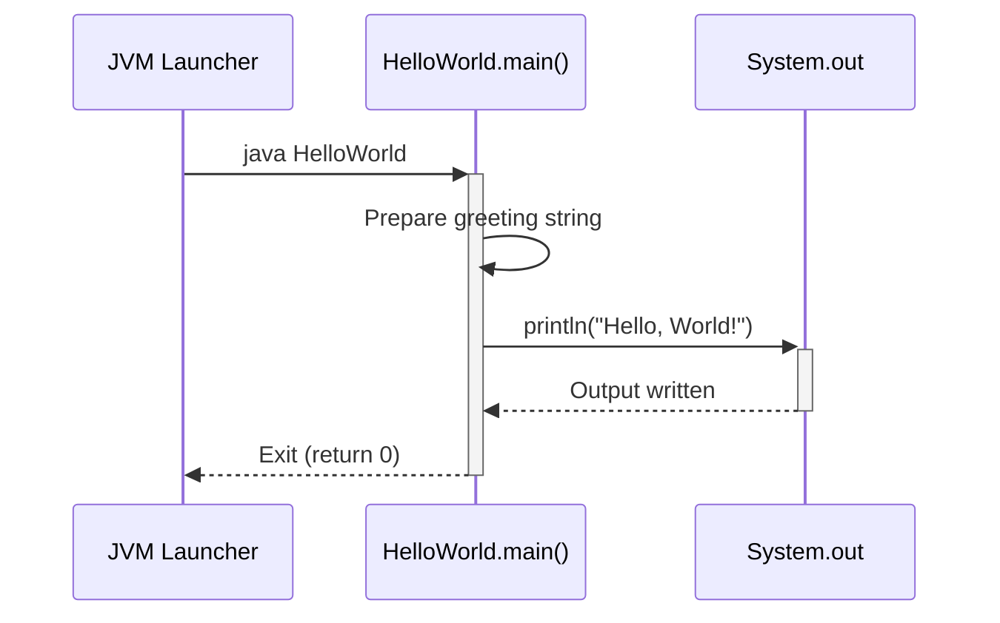

> **Document Metadata**
>
> | Item | Content |
> |------|------|
> | Document Version | v1.0 |
> | Author | AiWork (System Analysis & Design) |
> | Creation Date | 2026-09-15 |
> | Requirement Source | User request: "write a helloworld" |
> | Review Status | Pending Review |

# HelloWorld System Analysis Design

## 1. Requirement and Scope

### Background and Objectives

The project "manyu_test1" is a basic test/playground repository. The requirement is to **write a HelloWorld program** — the simplest introductory program that outputs a greeting message. The objective is to establish a working executable entry point for the project, demonstrating basic program structure and output functionality.

### Core Features

- **F01**: Output "Hello, World!" or similar greeting text to standard output (console)

### Constraints and Non-functional Requirements

- **Language**: Default to Java (commonly used enterprise language; test project baseline)
- **Simplicity**: Single-file implementation, no external dependencies
- **Portability**: Must run on any platform with a standard JDK installed
- Assumption: No specific programming language was specified; Java is selected as the default

### Excluded Scope

- No web/GUI/framework integration
- No database persistence
- No networking or I/O beyond console output
- No unit tests (beyond the scope of a single-file HelloWorld)
- No CI/CD pipeline configuration
- No multi-module or multi-service architecture

### Requirement Feature List and Priority

| ID | Feature Point | Priority | PRD Original Description/Section | Remarks |
|------|--------|--------|-------------------|------|
| F01 | Console HelloWorld output | P0 | "write a helloworld" | Core requirement; single executable entry point |

### Assumptions and Items to Confirm

| ID | Assumption/Item to Confirm | Current Assumption | Confirmation Status |
|------|-----------------|----------|----------|
| A01 | Programming language not specified | Default to Java (standard Oracle JDK 17+) | Pending |
| A02 | Output content not specified | Default to "Hello, World!" | Pending |
| A03 | Package structure not specified | Default to `com.example.helloworld` or default package | Pending |

## 2. Architecture and Modules

### Functional Architecture

- **Entry Layer**: Contains the single Java main class with the `main()` method entry point

**Module List**

| Module | Responsibility | Dependencies |
|------|------|------|
| HelloWorld Console App | Output greeting text to stdout | Java SE Runtime (no external dependencies) |

### Application Integration Architecture

**Not applicable for this item, reason:** HelloWorld is a standalone console application with no external system integration, no API exposure, and no middleware dependencies.

### Deployment Architecture

**Not applicable for this item, reason:** HelloWorld is a single-file program executed directly via `java` command. No load balancing, multi-instance deployment, or data layer is required.

## 3. Data Model and Storage

**Not applicable for this item, reason:** HelloWorld is a console application with no persistent data. It has no entities, no database tables, no cache, and no message queue. The program terminates after printing output; no data lifecycle or storage is involved.

## 4. Interface Design

**Not applicable for this item, reason:** HelloWorld is a standalone console application with no API layer. It exposes no oneapi (internal REST), OpenAPI (external REST), internal Service interfaces, or integration interfaces. The program's single entry point is the `public static void main(String[] args)` method invoked by the JVM launcher.

## 5. Feature Module Design

### Global Conventions

**Error Code Format:** Not applicable — HelloWorld has no error code system. The program either succeeds (prints output) or fails at JVM level (uncaught exception).

**Common Response Structure:** Not applicable — HelloWorld is a console application with no API response structure.

**Module Mapping Table:**

| Module Name | Description |
|------|------|
| HelloWorld Console App | Single main class printing "Hello, World!" |

### 5.1 HelloWorld Console App

#### 5.1.1 Table Structure Design

**Not applicable for this item, reason:** HelloWorld is a console application with no persistent storage. No database tables are defined.

#### 5.1.2 Interface Detailed Design

**Not applicable for this item, reason:** HelloWorld exposes no API interfaces. The single entry point is `public static void main(String[] args)` invoked by the JVM.

#### 5.1.3 Sub-feature Detailed Design

##### 5.1.3.1 Console Greeting Output (F01)

**Processing Sequence Diagram**

**Business Rules:**

| Rule ID | Rule Description | Validation Timing | Handling When Not Satisfied |
|----------|----------|----------|--------------|
| R01 | Greeting string must be non-empty | On program start | N/A — hardcoded constant cannot be empty |

**Exception Scenarios:**

| Exception Scenario | Handling |
|----------|----------|
| IOException on stdout | Propagate as uncaught RuntimeException; program terminates |

**Concurrency Control:**
- No concurrency risk, reason: Single-threaded console program with no shared state.

**State Machine Design:**
- Not applicable, reason: No entity with status fields exists.

#### 5.1.4 Technology Selection

**Language Comparison:**

| Option | Pros | Cons |
|--------|------|------|
| Java | Industry standard; strong typing; Maven/Gradle build ecosystem | Requires JDK installation; verbose for simple programs |
| Python | Zero compilation; concise syntax; ubiquitous on Linux/macOS | Runtime not pre-installed on some systems |
| Go | Single binary output; fast startup; built-in formatting | Requires Go toolchain; overkill for HelloWorld |
| Shell (Bash) | Native on Linux; simplest possible implementation | Not cross-platform |

**Recommendation:** Java
- Rationale: The repository name "manyu_test1" and the empty repo structure suggest a Java-oriented test project. Java is the most common enterprise language and provides clear compilation/execution semantics for a HelloWorld example.

## 6. Non-Functional Requirement Design

### 6.1 High Availability
**Not applicable for this item, reason:** HelloWorld is a single-run console program with no service lifetime. There is no upstream/downstream dependency, no need for degradation, failover, or multi-instance HA.

### 6.2 Extensibility
**Not applicable for this item, reason:** The HelloWorld program is intentionally minimal with a single responsibility. Extension beyond console output would constitute a new feature; the design supports extension by adding new classes in the same source tree without architectural changes.

### 6.3 Stability/Reliability
**Not applicable for this item, reason:** HelloWorld has no boundary conditions that could produce unstable results. The output string is a hardcoded constant; execution is deterministic.

### 6.4 Security Design
#### 6.4.1 Account System Solution
**Not applicable for this item, reason:** No user accounts or authentication involved.
#### 6.4.2 Authorization & Access Control
**Not applicable for this item, reason:** No resource access control needed for a console-printing program.
#### 6.4.3 Data Protection Solution
**Not applicable for this item, reason:** No sensitive data processed or stored.

### 6.5 Monitoring/Statistics/Logging/Alerting
**Not applicable for this item, reason:** Program runs to completion in sub-second time. No runtime monitoring or logging infrastructure is needed.

## 7. Change Management Triad

### 7.1 Monitorable
**Not applicable for this item, reason:** The HelloWorld program executes once and terminates. There are no services to instrument, no call latency to measure, and no processing results to monitor.

### 7.2 Gradual Rollout
**Not applicable for this item, reason:** HelloWorld is not a service candidate for gray release. The entire program is a single file; changes can be verified by compilation and execution locally. No tenant-based or traffic-based rollout is required.

### 7.3 Emergency Response
**Not applicable for this item, reason:** There is no running service to switch back or roll back. In the event of a faulty HelloWorld implementation, the fix is to edit the source file and recompile — no emergency switch or release rollback is needed.