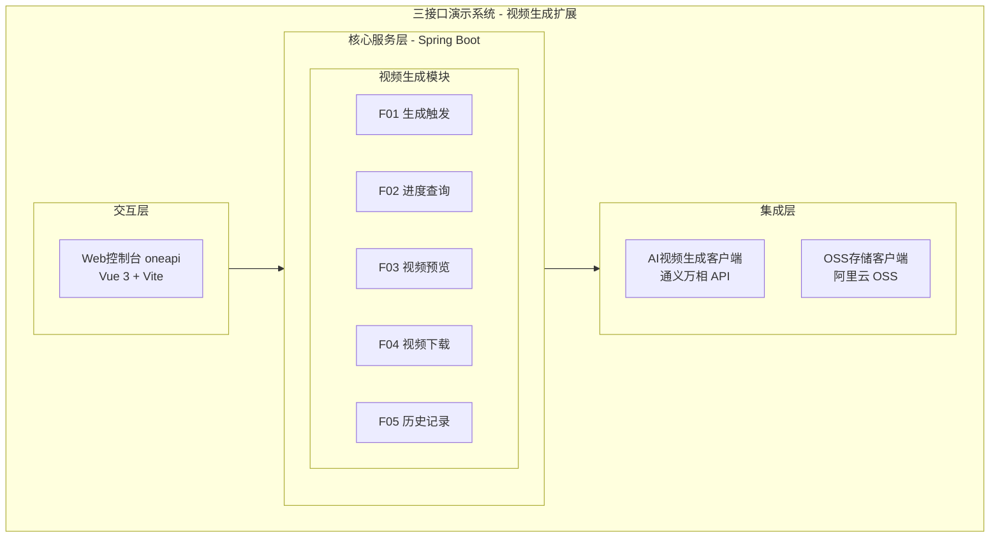
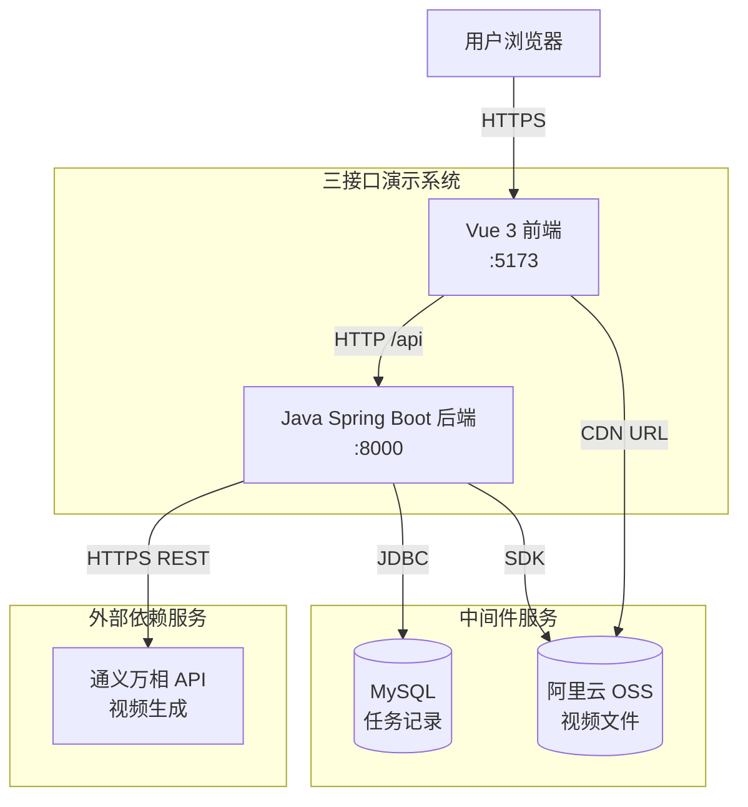
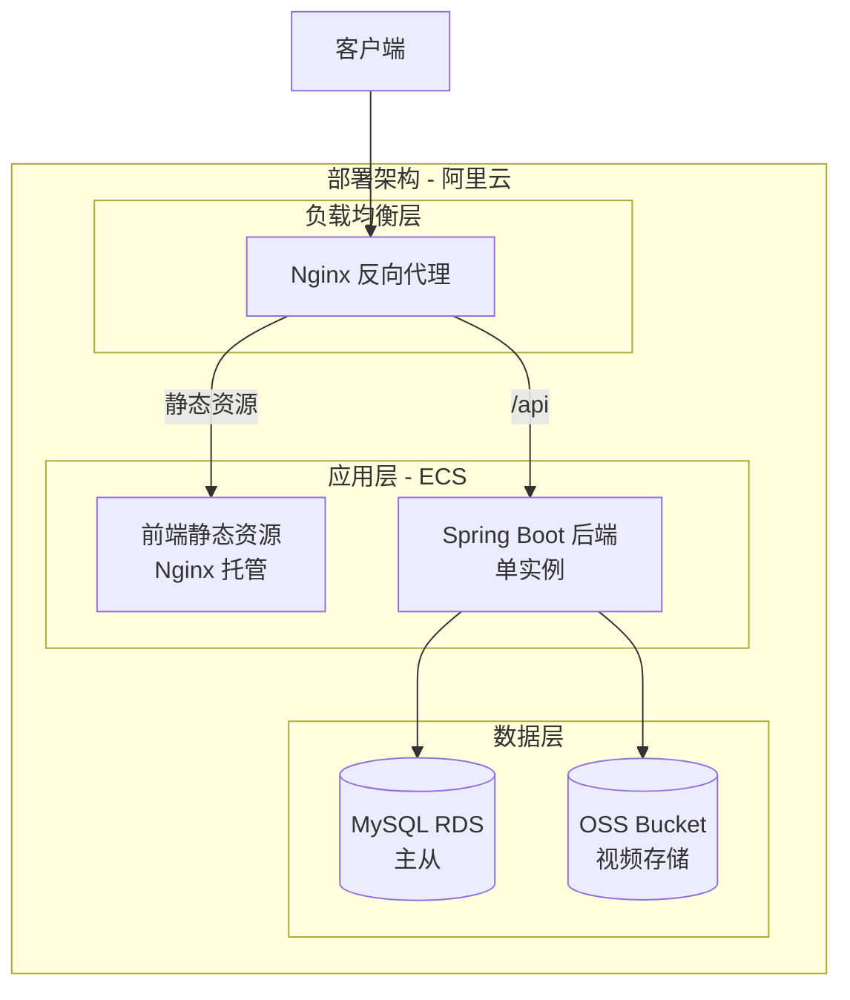
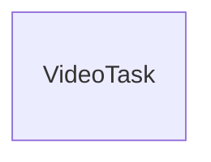
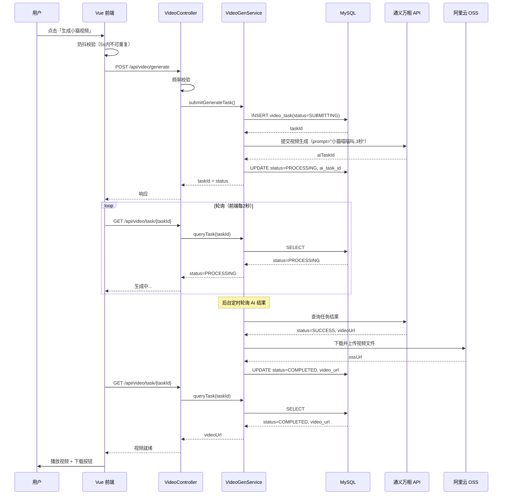
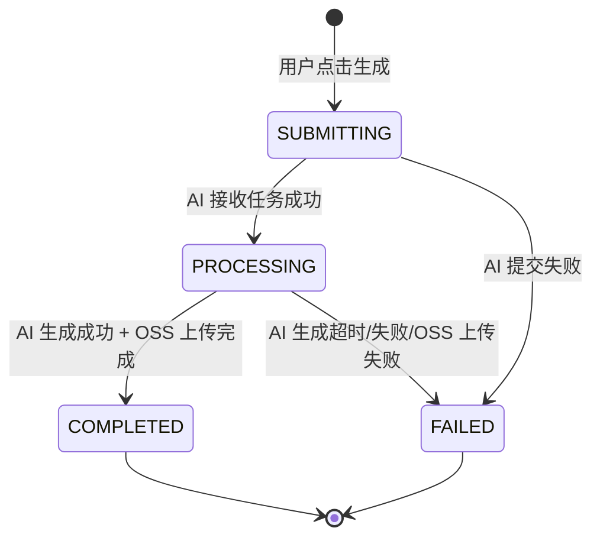
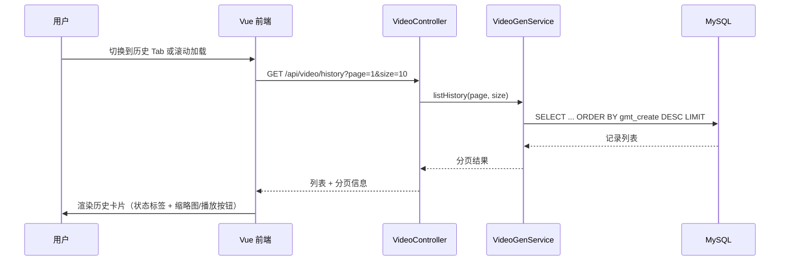

> **文档元信息**
>
> | 项目 | 内容 |
> |------|------|
> | 文档版本 | v1.0 |
> | 作者 | AiWork |
> | 创建日期 | 2026-09-17 |
> | 需求来源 | "生成一个3秒视频，小猫喵喵叫" |
> | 评审状态 | 待评审 |

# 小猫视频生成功能 系分设计

## 1. 需求与范围

### 背景与目标

**背景**：当前"三接口演示系统"（manyu-test1-frontend）提供了 Helloworld、哈希算法、冒泡排序三个演示功能，需要新增"视频生成"能力以拓展系统功能边界，验证 AI 多媒体生成集成能力。

**目标**：新增一个"小猫视频生成"功能模块，用户可通过前端界面一键生成一段 3 秒长的"小猫喵喵叫"短视频，支持在线预览和下载。

### 核心功能

1. **视频生成触发**：用户在前端点击"生成视频"按钮，系统调用后端服务生成一段 3 秒小猫喵喵叫视频。
2. **生成进度展示**：视频生成过程异步进行，前端展示生成进度（轮询）。
3. **视频预览与下载**：生成完成后，用户可在页面内嵌播放器预览视频，并支持下载到本地。
4. **生成历史记录**：记录用户每次生成请求及结果，便于回溯。

### 约束与非功能要求

- **时长约束**：生成视频精确为 3 秒。
- **内容约束**：视频内容为小猫 + 喵叫声（视觉 + 音频同步）。
- **性能**：单次视频生成耗时控制在 30 秒以内（含 AI 推理）。
- **可用性**：AI 视频生成服务不可用时，降级返回预设默认视频。
- **安全性**：API 需防刷（频率限制）。

### 排除范围

- 不支持自定义视频时长（固定 3 秒）
- 不支持自定义动物/内容（固定小猫喵喵叫）
- 不支持视频编辑/二次创作
- 不涉及用户注册登录（沿用现有系统访问方式）

### 需求功能清单与优先级

| 编号 | 功能点 | 优先级 | PRD 原始描述/章节 | 备注 |
|------|--------|--------|-------------------|------|
| F01 | 视频生成触发 | P0 | "生成一个3秒视频" | 核心入口，一键生成 |
| F02 | 生成进度展示 | P1 | "生成一个3秒视频" | 轮询任务状态 |
| F03 | 视频预览播放 | P0 | "小猫喵喵叫" | 内嵌播放器 |
| F04 | 视频下载 | P1 | "生成一个3秒视频" | 下载 .mp4 文件 |
| F05 | 生成历史记录 | P2 | 隐含需求 | 列表展示历史任务 |

### 假设与待确认项

| 编号 | 假设/待确认内容 | 当前假设 | 确认状态 |
|------|-----------------|----------|----------|
| A01 | AI 视频生成服务选型 | 假设使用通义万相（Tongyi Wanxiang）视频生成 API | 待确认 |
| A02 | 后端技术栈 | 假设使用 Java Spring Boot（与 dtazziboot 系列一致） | 待确认 |
| A03 | 视频存储方案 | 假设使用阿里云 OSS 对象存储 | 待确认 |
| A04 | 小猫视频具体内容 | 假设 AI 模型生成的是一只橘猫/英短对着镜头张嘴喵叫 | 待确认 |
| A05 | 部署环境 | 假设部署于阿里云 ECS，已有 Nginx 反向代理 | 待确认 |

---

## 2. 架构与模块

### 功能架构



- **交互层说明**：Vue 3 前端，在现有三 Tab 基础上新增第四个 Tab「视频生成」，提供触发按钮、进度条、视频播放器和下载按钮。
- **核心服务层说明**：Spring Boot 后端，新增 `video-generation` 模块，负责接收前端请求、调度 AI 生成任务、管理任务状态、提供视频文件访问。
- **集成层说明**：封装第三方 AI 视频生成 API 和 OSS 存储 SDK，对核心服务层屏蔽外部细节。

**模块清单**

| 模块 | 职责 | 依赖 |
|------|------|------|
| 视频生成前端模块（Vue） | 用户交互：触发生成、进度展示、视频预览/下载、历史列表 | 视频生成后端 API |
| 视频生成服务模块（Spring Boot） | 任务调度、状态管理、视频元数据持久化 | AI 视频生成客户端、OSS 客户端 |
| AI 视频生成客户端 | 封装通义万相 API 调用、轮询任务结果 | 通义万相 API |
| OSS 存储客户端 | 视频文件上传/下载/签名 URL 生成 | 阿里云 OSS |

### 应用集成架构



**集成关系说明：**

| 调用方 | 被调用方 | 协议 | 接口类型 | 说明 |
|--------|----------|------|----------|------|
| 用户浏览器 | Vue 前端 | HTTPS | oneapi | 页面交互 |
| Vue 前端 | Spring Boot 后端 | HTTP | oneapi REST | 通过 Vite proxy /api → :8000 |
| Spring Boot 后端 | MySQL | JDBC | SQL | 任务持久化 |
| Spring Boot 后端 | 阿里云 OSS | HTTPS（SDK） | SDK API | 上传视频文件 |
| Spring Boot 后端 | 通义万相 API | HTTPS | OpenAPI REST | 提交/查询视频生成任务 |
| 用户浏览器 | 阿里云 OSS | HTTPS | CDN | 直接加载视频文件播放 |

### 部署架构



**部署说明：**
- **负载均衡层**：Nginx 反向代理，前端静态资源直出，/api 路由到后端
- **应用层**：前端为 Nginx 托管静态文件；后端 Spring Boot 单实例运行于 ECS（初期流量小，不需要多副本）
- **数据层**：MySQL RDS 主从架构存储任务记录；OSS 存储视频文件，前端通过 CDN 加速访问

---

## 3. 数据模型与存储

### 实体清单

| 实体名称 | 实体说明 | 所属模块 | 与其他实体的关系 |
|----------|----------|----------|-----------------|
| VideoTask | 视频生成任务记录，包含任务状态、AI 任务 ID、结果视频 URL | 视频生成模块 | 独立实体 |

### 实体关系图



> 本需求仅涉及一个独立实体 `VideoTask`，无多实体关联。

**模型说明：**
- **VideoTask**：每次用户触发生成请求时创建一条记录。从"提交中"→"生成中"→"已完成/失败"的状态流转。完成后记录 OSS 文件 URL，前端通过该 URL 直接加载视频。考虑到本需求场景简单、生成频次低，无需引入缓存或 MQ——同步调用 AI API + 数据库轮询即可满足。
- **租户隔离**：当前系统为演示系统，无需多租户，不引入 tenant_id。

---

## 4. 接口设计

### 4.1 oneapi（Web 控制台接口）

| 编号 | 接口名称 | 方法 | 路径 | 模块 |
|------|----------|------|------|------|
| W01 | 触发生成视频 | POST | /api/video/generate | 视频生成 |
| W02 | 查询任务状态 | GET | /api/video/task/{taskId} | 视频生成 |
| W03 | 获取历史列表 | GET | /api/video/history | 视频生成 |

### 4.2 OpenAPI（对外接口）

本需求不涉及对外 OpenAPI，仅内部 Web 控制台使用。

### 4.3 内部接口（Service 层）

| 编号 | 接口名称 | 类 | 方法签名 |
|------|----------|------|----------|
| S01 | 提交视频生成任务 | VideoGenService | VideoTaskVO submitGenerateTask() |
| S02 | 查询任务详情 | VideoGenService | VideoTaskVO queryTask(Long taskId) |
| S03 | 分页查询历史记录 | VideoGenService | PageResult\<VideoTaskVO\> listHistory(int page, int size) |
| S04 | 轮询 AI 任务并更新状态 | VideoGenService | void pollAndUpdateTask(VideoTask task) |

### 4.4 集成接口（Integration 层）

| 编号 | 接口名称 | 类 | 方法签名 | 说明 |
|------|----------|------|----------|------|
| I01 | 提交视频生成 | AiVideoClient | String submitGeneration(String prompt, int duration) | 调用通义万相 API，返回 AI 任务 ID |
| I02 | 查询生成结果 | AiVideoClient | AiTaskResult queryResult(String aiTaskId) | 查询 AI 任务状态和结果视频 URL |
| I03 | 上传视频文件 | OssClient | String upload(byte[] videoData, String fileName) | 上传到 OSS，返回 CDN URL |
| I04 | 生成签名 URL | OssClient | String generateSignedUrl(String objectKey, long expireSec) | 生成带签名的临时访问 URL |

---

## 5. 功能模块设计

### 5.1 视频生成模块

#### 5.1.1 表结构设计

##### video_task（视频生成任务表）

| 字段名 | 数据类型 | 约束 | 默认值 | 说明 |
|--------|----------|------|--------|------|
| id | bigint | PK, 自增 | - | 系统自增主键 |
| ai_task_id | varchar(128) | NULL | NULL | AI 服务返回的任务 ID |
| status | varchar(32) | NOT NULL | 'SUBMITTING' | 任务状态：SUBMITTING/PROCESSING/COMPLETED/FAILED |
| video_url | varchar(512) | NULL | NULL | OSS 视频文件 CDN URL |
| video_duration | int | NOT NULL | 3 | 视频时长（秒），固定 3 |
| error_msg | varchar(512) | NULL | NULL | 失败时的错误信息 |
| gmt_create | datetime | NOT NULL | CURRENT_TIMESTAMP | 创建时间 |
| gmt_modified | datetime | NOT NULL | CURRENT_TIMESTAMP | 修改时间 |

**索引：**
- PK: `pk_video_task` (id)
- IDX: `idx_video_task_ai_task_id` (ai_task_id)
- IDX: `idx_video_task_status` (status)

##### 枚举与常量定义

| 枚举名称 | 取值 | 含义 | 关联字段 |
|----------|------|------|----------|
| TaskStatus | SUBMITTING | 提交中（等待 AI 接收） | video_task.status |
| TaskStatus | PROCESSING | 生成中（AI 处理中） | video_task.status |
| TaskStatus | COMPLETED | 已完成（视频就绪） | video_task.status |
| TaskStatus | FAILED | 生成失败 | video_task.status |

#### 5.1.2 接口详细设计

##### W01 触发生成视频

- **URI**: POST /api/video/generate
- **描述**: 用户一键触发小猫视频生成，返回任务 ID 供前端轮询
- **入参**: 无

- **出参**:

| 参数名称 | 类型 | 描述 |
|----------|------|------|
| code | int | 状态码，0=成功 |
| msg | String | 提示信息 |
| data.taskId | Long | 任务 ID |
| data.status | String | 初始状态 "SUBMITTING" |

- **错误码**:

| 错误码 | 说明 |
|--------|------|
| VIDEO_001 | 生成任务提交失败 |
| VIDEO_005 | 请求频率超限（同一会话 5 秒内仅允许 1 次） |

- **业务规则**: 前端限制 5 秒内不允许重复点击；后端做二次校验。

- **请求示例**: `POST /api/video/generate`（无请求体）

- **响应示例**:

```json
{
  "code": 0,
  "msg": "success",
  "data": {
    "taskId": 1001,
    "status": "SUBMITTING"
  }
}
```

##### W02 查询任务状态

- **URI**: GET /api/video/task/{taskId}
- **描述**: 根据任务 ID 查询当前状态和结果视频 URL
- **入参**:

| 参数名称 | 类型 | 是否必填 | 描述 |
|----------|------|----------|------|
| taskId | Long | 是 | 路径参数，任务 ID |

- **出参**:

| 参数名称 | 类型 | 描述 |
|----------|------|------|
| code | int | 状态码 |
| msg | String | 提示信息 |
| data.taskId | Long | 任务 ID |
| data.status | String | 当前状态 |
| data.videoUrl | String | 视频 CDN URL（COMPLETED 时返回） |
| data.duration | int | 视频时长（秒） |
| data.errorMsg | String | 错误信息（FAILED 时返回） |

- **错误码**:

| 错误码 | 说明 |
|--------|------|
| VIDEO_002 | 任务不存在 |

- **响应示例（生成中）**:

```json
{
  "code": 0,
  "msg": "success",
  "data": {
    "taskId": 1001,
    "status": "PROCESSING",
    "videoUrl": null,
    "duration": 3,
    "errorMsg": null
  }
}
```

- **响应示例（已完成）**:

```json
{
  "code": 0,
  "msg": "success",
  "data": {
    "taskId": 1001,
    "status": "COMPLETED",
    "videoUrl": "https://oss.example.com/videos/cat_meow_1001.mp4",
    "duration": 3,
    "errorMsg": null
  }
}
```

##### W03 获取历史列表

- **URI**: GET /api/video/history?page=1&size=10
- **描述**: 分页查询历史生成记录
- **入参**:

| 参数名称 | 类型 | 是否必填 | 描述 |
|----------|------|----------|------|
| page | int | 否 | 页码，默认 1 |
| size | int | 否 | 每页条数，默认 10，最大 50 |

- **出参**:

| 参数名称 | 类型 | 描述 |
|----------|------|------|
| code | int | 状态码 |
| msg | String | 提示信息 |
| data.list | Array | 任务列表（字段同 W02 data） |
| data.total | int | 总记录数 |
| data.page | int | 当前页码 |
| data.size | int | 每页条数 |

#### 5.1.3 子功能详细设计

##### 视频生成触发（F01）+ 生成进度展示（F02）+ 视频预览（F03）+ 视频下载（F04）

> 四个功能点高度耦合，合并设计。

**处理时序图：**



**业务规则：**

| 规则编号 | 规则描述 | 校验时机 | 不满足时的处理 |
|----------|----------|----------|--------------|
| R01 | 同一会话 5 秒内仅允许 1 次生成请求 | 前端点击时 + 后端接收时 | 提示"请稍后再试" |
| R02 | AI 生成固定 prompt："一只可爱的小猫对着镜头喵喵叫，3秒短视频" | 提交 AI 时 | 不可变更 |
| R03 | 视频时长固定 3 秒 | AI 参数传入 | 不可变更 |
| R04 | AI 生成超时 30 秒未完成视为失败 | 后台轮询时 | status=FAILED，error_msg="AI生成超时" |

**异常场景：**

| 异常场景 | 处理方式 |
|----------|----------|
| AI API 调用失败（网络/鉴权） | status=FAILED，error_msg 记录原始错误；前端展示"生成失败，请重试" |
| AI 返回视频为空 | status=FAILED，error_msg="AI返回结果为空" |
| OSS 上传失败 | status=FAILED，error_msg="视频存储失败"；重试 3 次后标记失败 |
| 数据库写入失败 | 事务回滚，返回 VIDEO_001 |

**并发控制：**
- 并发场景：同一用户快速连续点击可能产生多个任务
- 控制策略（单实例）：前端按钮防抖（5 秒）+ 后端基于会话的频率限制（Guava RateLimiter）
- 控制策略（多实例扩展）：切换为 Redis 计数器实现分布式频率限制（`INCR + EXPIRE`），保证跨实例一致

**状态机设计：**



**状态流转规则：**

| 当前状态 | 目标状态 | 流转条件 | 前置校验 | 触发动作 |
|----------|----------|----------|----------|----------|
| SUBMITTING | PROCESSING | AI API 返回有效 aiTaskId | aiTaskId 非空 | 更新 ai_task_id 字段 |
| SUBMITTING | FAILED | AI API 调用异常 | - | 记录 error_msg |
| PROCESSING | COMPLETED | AI 任务完成 + 视频已上传 OSS | video_url 非空 | - |
| PROCESSING | FAILED | AI 任务失败或超时 30s | - | 记录 error_msg |

##### 生成历史记录（F05）

**处理时序图：**



**业务规则：**

| 规则编号 | 规则描述 | 校验时机 | 不满足时的处理 |
|----------|----------|----------|--------------|
| R05 | 历史按创建时间倒序排列 | 查询时 | - |
| R06 | 已完成的任务支持点击播放和下载 | 前端渲染时 | FAILED/处理中的仅展示状态 |

**异常场景：**

| 异常场景 | 处理方式 |
|----------|----------|
| 数据库查询超时 | 返回空列表 + 前端提示"加载失败，请刷新" |

**并发控制**：纯只读查询，无并发风险。

#### 5.1.4 技术选型方案对比

| 选型项 | 方案 A | 方案 B | 推荐 | 理由 |
|--------|--------|--------|------|------|
| AI 视频生成 | 通义万相 | 即梦（字节） | 方案 A | 阿里云生态一致，中文 prompt 效果好 |
| 视频存储 | 阿里云 OSS | 本地磁盘 | 方案 A | CDN 加速、高可用、不占服务器资源 |
| 任务状态同步 | 前端轮询（2s） | WebSocket 推送 | 方案 A | 实现简单，3 秒视频生成 30s 内完成，轮询延迟可接受 |
| 后端框架 | Spring Boot | Node.js Express | 方案 A | 与 dtazziboot 系列一致 |

---

## 6. 非功能性需求设计

### 6.1 高可用性

- **AI 服务降级**：通义万相 API 不可用时，后端返回预设默认小猫视频（预上传至 OSS 的兜底视频），保证用户始终能得到结果。
- **OSS 降级**：OSS 上传失败时自动重试 3 次（指数退避 1s/2s/4s），仍失败则标记任务失败并记录日志告警。
- **数据库降级**：MySQL 不可用时，前端展示"服务繁忙，请稍后重试"友好提示。

### 6.2 可扩展性

- **水平扩展**：Spring Boot 无状态设计，可通过增加实例 + Nginx upstream 实现水平扩展。
- **定时任务协调**：多实例部署时，后台 AI 轮询任务需避免重复执行。方案对比：① ShedLock（基于数据库/Redis 的分布式锁，Spring 原生集成，轻量） vs ② XXL-JOB（重量级调度平台）。推荐方案① ShedLock，理由：任务简单（轮询 AI 结果 + 更新 DB），无需引入额外调度服务。
- **AI 服务可替换**：AiVideoClient 为接口抽象，切换视频生成供应商（即梦/可灵）仅需新增实现类，无需修改核心业务逻辑。
- **存储可替换**：OssClient 为接口抽象，支持切换 MinIO / AWS S3 等对象存储。

### 6.3 稳定性/可靠性

- **边界场景**：用户快速连续点击 → 前端防抖 + 后端频率限制双重保障。
- **AI 超时保护**：30 秒超时自动标记失败，避免资源长时间占用。
- **数据库连接池**：HikariCP 默认配置，连接泄漏自动回收。

### 6.4 安全性设计

#### 6.4.1 账户系统方案
本项不适用，原因：当前为演示系统，无需用户登录，开放访问。

#### 6.4.2 授权与访问控制
##### 6.4.2.1 是否实现水平权限检查
本项不适用，原因：无用户体系，所有请求均为公共访问。
##### 6.4.2.2 是否实现垂直权限检查
本项不适用，原因：无角色体系，仅一个生成入口。
##### 6.4.2.3 是否检查登录态
本项不适用，原因：演示系统，不要求登录。

#### 6.4.3 数据防护方案
##### 6.4.3.1 是否对敏感数据加密存储
无敏感数据，视频为公开小猫内容，不涉及个人信息。
##### 6.4.3.2 是否对敏感数据展示进行脱敏
本项不适用，原因：无敏感数据展示。

### 6.5 性能

- **并发预估**：演示系统，预期 QPS < 1，无需缓存层。
- **AI 调用耗时**：通义万相视频生成 API 预期 10-20 秒，在 30 秒超时范围内。
- **视频文件大小**：3 秒 720p MP4 预估 < 2MB，OSS + CDN 可直接服务。

### 6.6 监控/统计/日志/告警

- **关键监控点**：AI API 调用成功率、OSS 上传成功率、任务状态分布。
- **日志**：每次 AI 调用记录请求/响应日志（含耗时）；OSS 上传记录文件大小和耗时。
- **告警**：AI API 连续 3 次失败触发告警；OSS 上传连续失败触发告警。

---

## 7. 变更三板斧

### 7.1 可监控

| 监控项 | 埋点位置 | 监控指标 | 告警阈值 |
|--------|----------|----------|----------|
| 生成请求量 | VideoController.generate() | 请求计数 + 被限流计数 | 被限流占比 > 50% 告警 |
| AI API 调用 | AiVideoClient.submitGeneration() | 调用耗时、成功率、超时次数 | 成功率 < 90% 或 P99 > 25s |
| OSS 上传 | OssClient.upload() | 上传耗时、重试次数 | 重试率 > 10% |
| 任务状态分布 | VideoGenService 定时任务 | 各状态任务数 | PROCESSING 堆积 > 10 告警 |

### 7.2 可灰度

本需求为全新功能，灰度策略采用**功能开关**方式：

通过配置中心（Nacos/Apollo）控制 `video.generate.enabled` 开关，默认关闭，逐步放开：
1. 上线后默认关闭，仅开发/测试环境可访问
2. 验证通过后，生产开启开关，全量放开
3. 如遇问题，关闭开关即可快速止血

### 7.3 可应急

| 应急场景 | 应急方案 | 回滚考量 |
|----------|----------|----------|
| AI API 故障 | 关闭功能开关，前端隐藏"视频生成"Tab | 无回滚需求，开关即可 |
| OSS 故障 | 关闭功能开关 | 无回滚需求 |
| 数据库故障 | 关闭功能开关 | 无需单独回滚 |
| 前端 JS 报错 | 关闭功能开关 + 回滚前端静态资源到上一版本 | 前端为纯静态文件，Nginx 目录替换即可回滚，不影响其他 Tab |

**应急关键点**：
- 新增模块为独立 Tab，不修改现有 Helloworld/哈希/冒泡排序功能
- 前端功能开关通过后端配置下发，前端根据开关控制 Tab 显隐
- 后端功能开关 = 0 侵入：关闭后 /api/video/* 路由全部返回 503，不影响其他 /api 路由